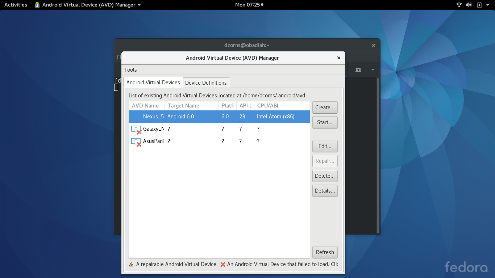
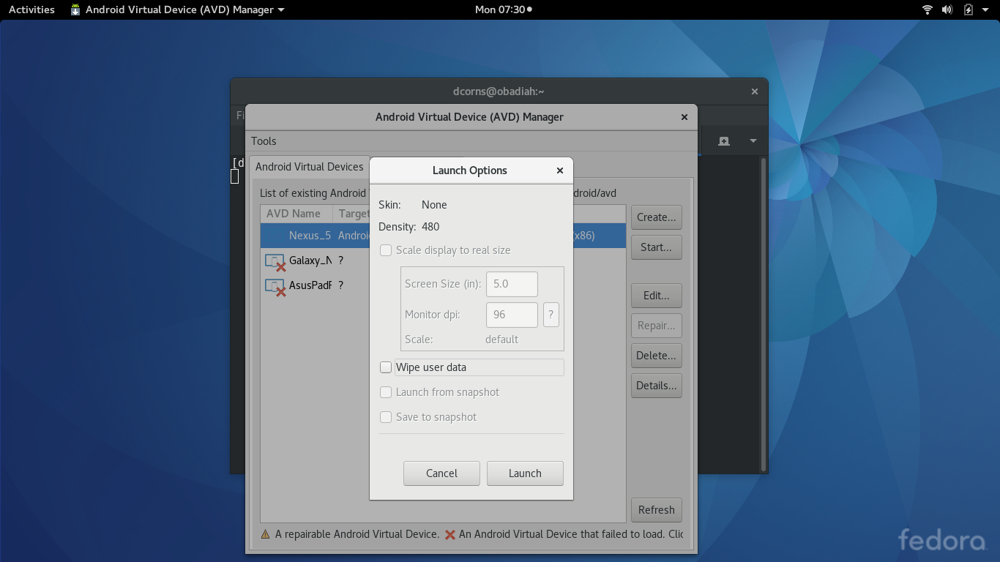
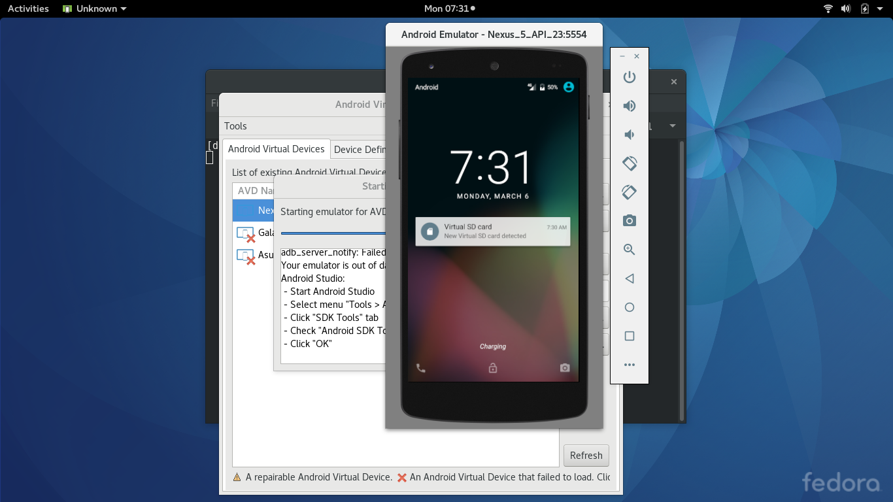
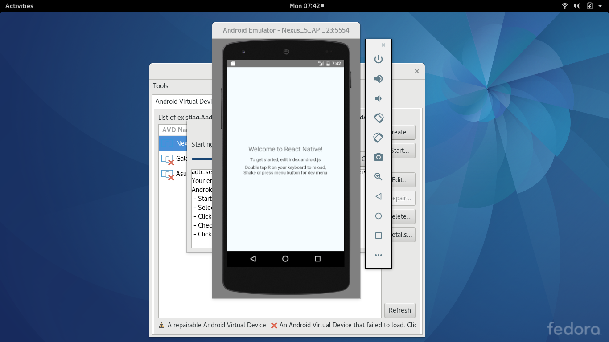

#Making a To-do Application with [React Native](https://facebook.github.io/react-native/)
###Exploring the [react native](https://facebook.github.io/react-native/) frame work.
 This is a tutorial designed to explore the basics of using the react native framework to create native applications for android and ios device operating systems. Since compiling the code for ios devices requires an apple device, we will be demonstrating usage of the framework for android. This will make it possible for a wider audience to benefit. I have avoided using device specific imports, so it is expected that the code will produce the same results on an ios device if placed into the required file (index.ios.js). There are also some minor differences in installation steps for ios development which will not be covered. If anyone tries this, please pass on the results and I will attempt to update the tutorial. Also, I always welcome useful feedback regarding anything I write.
 ### Prerequisites
 This tutorial is slightly advanced and as such will not cover the basics of [node](https://nodejs.org) or [npm](https://www.npmjs.com). If you do not know what these are or how to use them, familiarize yourself first, or proceed if you enjoy the additional challenge. We will be using [yarn](https://yarnpkg.com) rather than npm to install and manage modules, but those familiar with npm will have no problem translating the yarn commands.
 ###Getting Started
 I use yarn instead of npm because it has useful features which I believe make it superior, however, as stated above translating yarn commands that sometimes differ slightly from npm should be self explanatory. The main difference to be aware of is that the yarn add 'command' is equivalent to the npm 'install' command. If you would like to try out yarn use the following the installation instructions here [Linux](https://yarnpkg.com/en/docs/install#linux-tab), [macOS](https://yarnpkg.com/en/docs/install#mac-tab), [Windows](https://yarnpkg.com/en/docs/install#windows-tab). That said, let's open a terminal window and get started.
 ####Installing the React Native command line interface (CLI)
 Using the CLI makes getting started with React Native easy.

`yarn add global react-native-cli` or using npm
`npm install -g react-native-cli`

####Download and install Android Studio
Since we are writing primarily for Android, we need to install [Android Studio](https://developer.android.com/studio/install.html). It is an IDE developed for the purpose of writing native applications with Java, but we need it because it provides the Android SDK and AVD (emulator) required to run and test our React Native application. Download Android studio. You can find the download for linux [here](https://developer.android.com/studio/index.html). If you are not using linux you can find your download by starting [here](https://developer.android.com/studio/install.html). Once downloaded, there are a number of unique steps involved to install Android Studio on your particular operating system. Fortunately the people of Android Studio have provided excellent detailed instructions on how to do the installation for the most popular operating systems, including videos. You can find the instructions [here](https://developer.android.com/studio/install.html). Then choose your operating system from the drop down list on the upper right side of the page body.
####Configuring Android Studio
Rather than doing a copy paste of the information provided on the React Native site, I will now refer you [there](https://facebook.github.io/react-native/docs/getting-started.html#content) I recommend that you also install watchman even though it is optional. Once you have configured it according to the provide instructions and tested that everything is working, we can start building our to-do application.
##Creating The To-Do Application
####Making scaffolding for the application
We use the CLI to lay out the scaffolding. Change to the directory where you want the application reside and enter `react-native init todo`. You may have notice that we do not hyphenate the name to-do. The reason is that the CLI only accepts alphanumeric symbols for an application name. A number of messages are outputted to the screen with the last messages being instructions on how to start up the basic application that the CLI has created.
#####Starting the AVD
Before we can start the application, we have to provide something for it to run on. I you have android phone, you could plug it into the USB port of the computer. There are some other things that must be done in order for that to work. For those who have an android phone, we will address installing our app on it at the end. For now we will use the virtual device provided through the AVD. Start the avd by running the command `adroid avd`. You should see something similar to the following:

You should see at least one device available that uses the 6.0 platform. If you do not, you will need to create or download one. It should have been installed when you followed the Native React and Android Studio installation/configuration steps. Selecting the device and clicking start will present the launcher shown below.
 
 You do not need to change any options here so just click the Launch button. Your virtual device should now be displayed.
 
 #####Testing the scaffolding
 Now that our device is running, we can make sure our application scaffolding is functioning before we start working on the todo application. Make sure to swipe the device display to unlock it before running the react-native command or the command may fail.
 ```
 cd todo
 react-native run-android
 ```
 If all is working, you should see something similar to the following image.
 
 Great, now we are ready to get to work.