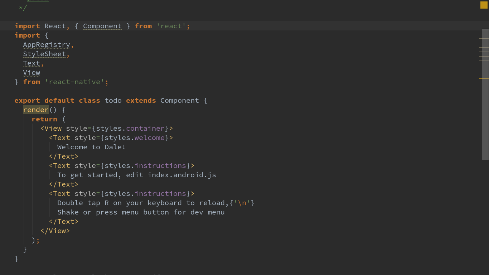

#Making a To-do Application with [React Native](https://facebook.github.io/react-native/)
###Exploring the [react native](https://facebook.github.io/react-native/) frame work.
 This is a tutorial designed to explore the basics of using the react native framework to create native applications for android and ios device operating systems. Since compiling the code for ios devices requires an apple device, we will be demonstrating usage of the framework for android. This will make it possible for a wider audience to benefit. I have avoided using device specific imports, so it is expected that the code will produce the same results on an ios device if placed into the required file (index.ios.js). There are also some minor differences in installation steps for ios development which will not be covered. If anyone tries this, please pass on the results and I will attempt to update the tutorial. Also, I always welcome useful feedback regarding anything I write.
 ### Prerequisites
 This tutorial is slightly advanced and as such will not cover the basics of [node](https://nodejs.org) or [npm](https://www.npmjs.com). If you do not know what these are or how to use them, familiarize yourself first, or proceed if you enjoy the additional challenge. We will be using [yarn](https://yarnpkg.com) rather than npm to install and manage modules, but those familiar with npm will have no problem translating the yarn commands.
 ###Getting Started
 I use yarn instead of npm because it has useful features which I believe make it superior, however, as stated above translating yarn commands that sometimes differ slightly from npm should be self explanatory. The main difference to be aware of is that the yarn add 'command' is equivalent to the npm 'install' command. If you would like to try out yarn use the following the installation instructions here [Linux](https://yarnpkg.com/en/docs/install#linux-tab), [macOS](https://yarnpkg.com/en/docs/install#mac-tab), [Windows](https://yarnpkg.com/en/docs/install#windows-tab). That said, let's open a terminal window and get started.
 ####Installing the React Native command line interface (CLI)
 Using the CLI makes getting started with React Native easy.

`yarn add global react-native-cli` or using npm
`npm install -g react-native-cli`

####Download and install Android Studio
Since we are writing primarily for Android, we need to install [Android Studio](https://developer.android.com/studio/install.html). It is an IDE developed for the purpose of writing native applications with Java, but we need it because it provides the Android SDK and AVD (emulator) required to run and test our React Native application. Download Android studio. You can find the download for linux [here](https://developer.android.com/studio/index.html). If you are not using linux you can find your download by starting [here](https://developer.android.com/studio/install.html). Once downloaded, there are a number of unique steps involved to install Android Studio on your particular operating system. Fortunately the people of Android Studio have provided excellent detailed instructions on how to do the installation for the most popular operating systems, including videos. You can find the instructions [here](https://developer.android.com/studio/install.html). Then choose your operating system from the drop down list on the upper right side of the page body.
####Configuring Android Studio
Rather than doing a copy paste of the information provided on the React Native site, I will now refer you [there](https://facebook.github.io/react-native/docs/getting-started.html#content) 
##Preparing to Create The To-Do Application
####Making scaffolding for the application
We use the CLI to lay out the scaffolding. Change to the directory where you want the application reside and enter `react-native init todo`. You may have notice that we do not hyphenate the name to-do. The reason is that the CLI only accepts alphanumeric symbols for an application name. A number of messages are outputted to the screen with the last messages being instructions on how to start up the basic application that the CLI has created.
#####Starting the AVD
Before we can start the application, we have to provide something for it to run on. I you have android phone, you could plug it into the USB port of the computer. There are some other things that must be done in order for that to work. For those who have an android phone, we will address installing our app on it at the end. For now we will use the virtual device provided through the AVD. Start the avd by running the command `adroid avd`. You should see something similar to the following:

You should see at least one device available that uses the 6.0 platform. If you do not, you will need to create or download one. It should have been installed when you followed the Native React and Android Studio installation/configuration steps. Selecting the device and clicking start will present the launcher shown below.
 
 You do not need to change any options here so just click the Launch button. Your virtual device should now be displayed.
 
 #####Testing the scaffolding
 Now that our device is running, we can make sure our application scaffolding is functioning before we start working on the todo application. Make sure to swipe the device display to unlock it before running the react-native command or the command may fail.
 ```
 cd todo
 react-native run-android
 ```
 If all is working, you should see something similar to the following image.
 
 Great, now we are ready to get to work.
 ##Writing the To-Do App
 After completing this section we will have an application that looks like this.
 
 ####The File Structure
 #####File structure generated by the CLI
 You will notice that everything required for the default application generated by the CLI is contained in the project's root directory. Also, all of the code for the application is contained in the index.android.js and index.ios.js files. As indicated by the file names, index.android.js is the code for the android device and index.ios.js is the code tor the ios device. When initializing a new application with the CLI. The code for both device types is exactly the same. Some components used with react-native can be device specific, but if no device specific components are implemented, then one code base can be used for both device types. The same code can be used in the index.android.js and index.ios.js files. I have attempted to keep the code for this tutorial void of device specific components, so you should be able to go through the tutorial successfully regardless of which platform you are using. I am targeting android and have not tested the code on an ios device, but I expect it to work should one put identical code in the index.ios.js. If you are working with ios and find this is not true, please notify me so I can update the text. We will be writing the top level component of our application in one the two index files depending on your target. We do not need to concern ourselves with the rest of the files and directories generated by the CLI.
 #####Our application's file structure
 Add the following directory structure under project root: `src/components` `src/data` `src/styles` Since the application is small, we do not need to have a file structure any more complicated than this. All the components we create will reside in *src/components*, all our data models will reside in *src/data* and all the styles will be stored in *src/styles*. In the end, one may argue that we do not even need the data or styles directories as they will only contain one file, but I prefer to always have the separation of concerns emulated by my directory structure. No that this is in place we can infer that the application originates from index.android.js and/or index.ios.js respectively and that all the other code that we write will be found within the **src** directory.
 #####index.js and application state
 *(Throughout the rest of this tutorial I will refer to both index.android.js and index.ios.js as just index.js. You will want to refer to the file that matches your target device)*<br/>
 Breaking down index.js:<br/>
 
 *We are using ES6 in this tutorial. Since this may still be new for some, helpful links are provided throughout.*<br/>
  [ES6 import](https://developer.mozilla.org/en-US/docs/Web/JavaScript/Reference/Statements/import)<br/>
 The first import statement gives us the react component and is the only import from react that we will need. All the component files we create will require this import. The second import statement gives us the ability to write our native application using JavaScript.<br/>
 **AppRegistry:** Module for registering the application<br/>
 **StyleSheet:** Module for creating style sheets<br/>
 **Text:** Module for wiring up text<br/>
 **View:** This module is required to display anything natively on the device.<br/>
 [ES6 export default](https://developer.mozilla.org/en-US/docs/Web/JavaScript/Reference/Statements/export) [class](https://developer.mozilla.org/en-US/docs/Web/JavaScript/Reference/Classes)<br/>
 Next we see the default class which is the root of our application. The only thing inside is the opening render function which, as you can see, is responsible for what we see on the phone. We will be making quite a few changes to this class as we move along, but for now lets go over the basics. The render function is simply returning some JSX. JSX is mostly just html within a function that react will compile into javascript in order to be used with the framework. You can click the link for more info on [JSX](https://facebook.github.io/react/docs/jsx-in-depth.html). The tags we are using have special meaning. Let's take them one at a time. </br>
 **View:** This tag will always be the first tag used when we want to render a view. You will notice that it is imported from react-native indicating that it is used to interact with our phone. This is the main view of our application and represents the content of our entire startup screen. Everything displayed in the application will displayed in a view. Views can also be specified inside of other views.</br>
 **Text** Our Text tag is self explanatory. If we want to display text, We put it in a Text tag that resides in a View tag. The app generated by the cli uses three separate Text tags. You will notice that the by doing this we have each text entry being automatically displayed separately from the others. This is a departure from HTML which is concerned with semantics and not formatting. In react-native, our tags are used to represent native features of the device for which we are writing the code. You should notice that the entire application code for our application currently resides in index.android.js. We could have continued to write our entire application in this one file, but any application of substance would not be put together this way, so we will take a more realistic approach.(From this point on, you will find a link to the commit in the code accompanying this tutorial that contains takes place at that particular point in the tutorial)</br>
 [599a07387d644bb47caf400c8551dd8f4d029e1e](https://github.com/dcorns/todo/commit/599a07387d644bb47caf400c8551dd8f4d029e1e)
 ###Adding our code
 